# Tugas 2 - Array Function

## Identitas
- Nama: Aditya
- NIM: F1D02310032

## Deskripsi Tugas
Tugas ini dibuat untuk memahami penggunaan beberapa method array JavaScript pada data karakter Genshin Impact. Data yang digunakan berisi 20 karakter dengan informasi nama, jenis senjata, dan rarity.

Enam method yang diterapkan dalam program ini adalah:
- `map()`
- `filter()`
- `reduce()`
- `find()`
- `some()`
- `every()`

### Cara Menjalankan
```bash
node arrayMethods_F1D02310032.js
```

---

## Implementasi dan Hasil

### 1. `map()`
Tujuan: membuat ringkasan data nama, senjata, dan rarity dari semua karakter.

#### Kode
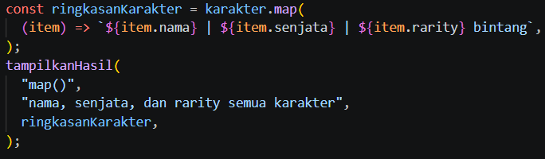

#### Hasil
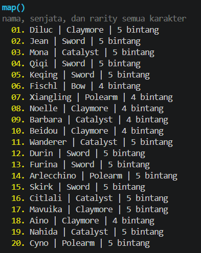

---

### 2. `filter()`
Tujuan: menampilkan karakter yang memiliki rarity bintang 5.

#### Kode
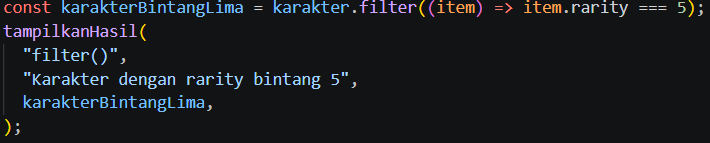

#### Hasil
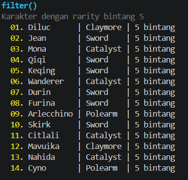

---

### 3. `reduce()`
Tujuan: menghitung jumlah karakter berdasarkan rarity.

#### Kode
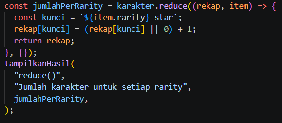

#### Hasil
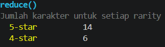

---

### 4. `find()`
Tujuan: mencari karakter pertama yang menggunakan senjata Catalyst.

#### Kode
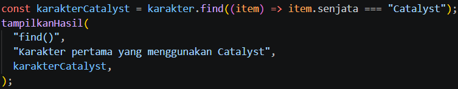

#### Hasil
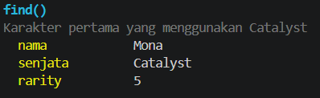

---

### 5. `some()`
Tujuan: memeriksa apakah ada karakter 5★ yang menggunakan senjata Claymore.

#### Kode
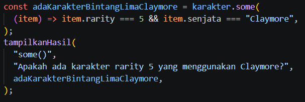

#### Hasil
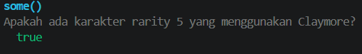

---

### 6. `every()`
Tujuan: memeriksa apakah semua karakter menggunakan senjata yang sama.

#### Kode
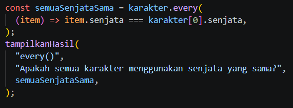

#### Hasil
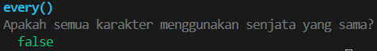

---

## Kesimpulan
Setiap method array memiliki fungsi yang berbeda namun sama-sama penting dalam pengolahan data:

- `map()` digunakan untuk memetakan dan mengubah setiap elemen menjadi bentuk baru.
- `filter()` digunakan untuk memilih elemen yang memenuhi kondisi tertentu.
- `reduce()` digunakan untuk menggabungkan seluruh elemen menjadi satu nilai.
- `find()` digunakan untuk mencari elemen pertama yang cocok.
- `some()` mengecek apakah setidaknya satu elemen memenuhi kondisi.
- `every()` mengecek apakah semua elemen memenuhi kondisi.

Dengan penerapan ini, proses pengolahan data pada array menjadi lebih terstruktur, efektif, dan mudah dipahami.
